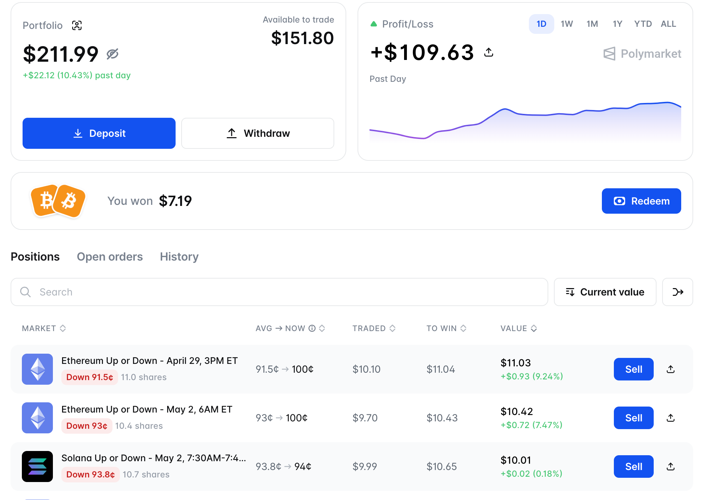

# Polymarket Crypto Trading Bot

*[English](README.md) | [中文](README_zh.md)*

⚠️ **Note: This project is primarily a Python development scaffold/boilerplate for Polymarket. The built-in "Flash Crash" strategy is currently ineffective and deprecated. Please use it with caution or strictly for educational purposes.**

A Python trading bot scaffold for Polymarket with gasless transactions and real-time WebSocket orderbook streaming. This repository contains the core trading library and a reference Flash Crash volatility trading strategy.



## Features

- **Flash Crash Strategy** - Automated volatility trading strategy that detects probability drops on 5m/15m/1h markets and capitalizes on market inefficiencies.
- **Multi-Coin Support** - Run concurrent strategies for different coins (BTC, ETH, SOL, XRP, etc.) using a single JSON configuration file.
- **Gasless Trading** - Built-in Builder Program integration for zero gas fees.
- **Real-time WebSocket** - Live orderbook updates and market data streaming.
- **Secure Storage** - PBKDF2 + Fernet encrypted private key storage.
- **Modular API** - Clean, intuitive Python interface for custom strategy development.

## Quick Start

### Prerequisites

- Python 3.8 or higher
- Polymarket Proxy Wallet (Safe)
- Private Key

### 1. Installation

```bash
# Clone the repository
git clone https://github.com/ChyranOY/polybot-crypto-py.git
cd polybot-crypto-py

# Create and activate virtual environment
python3 -m venv .venv
source .venv/bin/activate

# Install dependencies
pip install -r requirements.txt
```

### 2. Configuration

First, configure your environment variables. Copy the example file and fill in your private key and proxy wallet address:

```bash
cp .env.example .env
```

Edit the `.env` file to ensure it contains the required variables:

```bash
PRIVATE_KEY=your_private_key
PROXY_WALLET=0xYourPolymarketProxyWallet
```

> **PROXY WALLET**: Find your safe address at [polymarket.com/settings](https://polymarket.com/settings).

Next, set up your strategy configuration. Create a `config.json` file in the root directory to define trading parameters for each coin:

```json
{
  "BTC": {
    "interval": "15m",
    "size": 11,
    "drop": 0.40,
    "lookback": 5,
    "take_profit": 0.50,
    "stop_loss": 0.50,
    "min_price": 0.11,
    "max_price": 0.89,
    "slippage": 0.025,
    "max_spread": 0.021
  },
  "ETH": {
    "interval": "15m",
    "size": 100,
    "drop": 0.30
  }
}
```

### 3. Configuration Check

Before running the strategy, it is highly recommended to run the self-check script to verify your environment setup:

```bash
python scripts/config_self_check.py
```

### 4. Running the Strategy

Run the Flash Crash strategy using your JSON configuration:

```bash
# Run strategy using a configuration file
python apps/flash_crash_runner.py --config-file config.json

# Run in dry-run mode (no real trades)
python apps/flash_crash_runner.py --config-file config.json --dry-run

# Run with debug logging
python apps/flash_crash_runner.py --config-file config.json --debug
```

## Trading Strategies

### Flash Crash Strategy (`apps/flash_crash_strategy.py`)

⚠️ **WARNING: This strategy is currently ineffective and deprecated. It is not recommended for production use and is provided solely for learning and reference purposes.**

Monitors markets for sudden probability drops and executes trades automatically based on the parameters provided in `config.json`. 

**Key Parameters in `config.json`:**
- `interval` - Market interval (default: 15m)
- `size` - Trade size in tokens
- `drop` - Absolute probability drop threshold
- `lookback` - Detection window in seconds
- `take_profit` - Take profit percentage
- `stop_loss` - Stop loss percentage
- `min_price` - Minimum allowed price
- `max_price` - Maximum allowed price
- `max_spread` - Maximum acceptable spread

## Usage Examples

### Basic Usage

```python
from src import create_bot_from_env
import asyncio

async def main():
    bot = create_bot_from_env()
    orders = await bot.get_open_orders()
    print(f"Open orders: {len(orders)}")

if __name__ == "__main__":
    asyncio.run(main())
```

### Place an Order

```python
import asyncio
from src import TradingBot, Config

async def place_order():
    # Initialize bot with config and private key
    bot = TradingBot(config=Config(safe_address="0x..."), private_key="0x...")

    # Place a limit order
    result = await bot.place_order(token_id="...", price=0.65, size=10.0, side="BUY")
    if result.success:
        print(f"Order placed successfully: {result.order_id}")
    else:
        print(f"Order failed: {result.message}")

if __name__ == "__main__":
    asyncio.run(place_order())
```

### WebSocket Streaming

```python
import asyncio
from src.websocket_client import MarketWebSocket

async def stream_market():
    ws = MarketWebSocket()
    ws.on_book = lambda s: print(f"Mid Price: {s.mid_price:.4f}")
    await ws.subscribe(["token_id"])
    await ws.run()

if __name__ == "__main__":
    asyncio.run(stream_market())
```

## Configuration Reference

### Environment Variables

| Variable | Required | Description |
|----------|----------|-------------|
| `PRIVATE_KEY` | Yes | Wallet private key |
| `PROXY_WALLET` | Yes | Polymarket Proxy wallet address |
| `POLY_BUILDER_CODE` | Optional | Builder referral code for CLOB v2 order attribution |
| `POLY_RELAYER_API_KEY` | Optional | Relayer API key for Gasless Transactions |
| `POLY_RELAYER_API_KEY_ADDRESS` | Optional | Relayer API key address |
| `POLY_RPC_URL` | Optional | Polygon RPC URL (default: https://polygon-rpc.com) |
| `POLY_CHAIN_ID` | Optional | Chain ID (default: 137) |
| `POLY_CLOB_HOST` | Optional | CLOB API host (default: https://clob.polymarket.com) |
| `POLY_DATA_DIR` | Optional | Directory for storing encrypted credentials |
| `POLY_LOG_LEVEL` | Optional | Logging level (DEBUG, INFO, WARNING, ERROR) |
| `POLY_DEFAULT_SIZE` | Optional | Default order size in USDC |
| `POLY_DEFAULT_PRICE` | Optional | Default order price |

## Gasless Trading & Builder Attribution

To enable zero gas fees and get volume attribution on the Builder Leaderboard:

1. Apply at [polymarket.com/settings?tab=builder](https://polymarket.com/settings?tab=builder)
2. For **Order Attribution**: Set `POLY_BUILDER_CODE` in your `.env`. The bot will automatically inject this into the `OrderArgs` on CLOB V2.
3. For **Gasless On-chain Transactions** (like token approvals or CTF operations), Polymarket now uses the Relayer API Key. Set `POLY_RELAYER_API_KEY` and `POLY_RELAYER_API_KEY_ADDRESS` in your `.env` (create these in [Settings > API Keys](https://polymarket.com/settings?tab=api-keys)).

## Security

Private keys can be encrypted using PBKDF2 (480,000 iterations) + Fernet symmetric encryption. Best practices:
- Never commit `.env` or configuration files containing real keys to version control.
- Use a dedicated trading wallet with limited funds.
- Keep encrypted key files secure (permissions: `0600`).

## Disclaimer

This software is for educational purposes only. Trading involves a significant risk of loss. The developers are not responsible for any financial losses incurred while using this bot.
